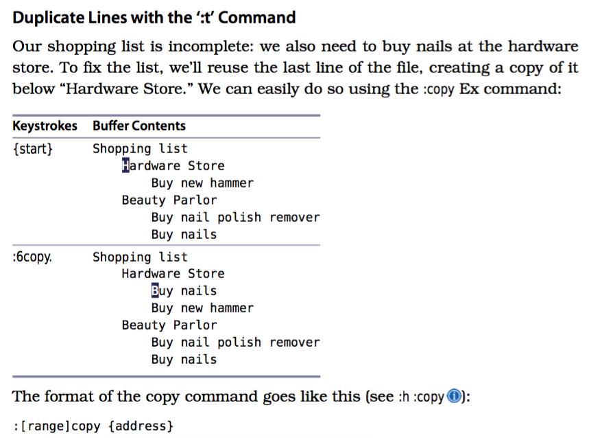

<h2>Table of Contents</h2>

<ul>
<li><a href="#orgheadline53">1. Practical Vim</a>
<ul>
<li><a href="#orgheadline1">1.1. Key Conventions</a></li>
<li><a href="#orgheadline3">1.2. Commands</a>
<ul>
<li><a href="#orgheadline2">1.2.1. Operator Commands</a></li>
</ul>
</li>
<li><a href="#orgheadline9">1.3. Chpater1, Basic</a>
<ul>
<li><a href="#orgheadline4">1.3.1. Tip1, Meet Dot Command</a></li>
<li><a href="#orgheadline5">1.3.2. Tip2, Do not repeat yourself</a></li>
<li><a href="#orgheadline6">1.3.3. Two for the one price</a></li>
<li><a href="#orgheadline7">1.3.4. Tip3, Take One Step Back, Then Three Forward</a></li>
<li><a href="#orgheadline8">1.3.5. Tip4, Act, Repeat, Reverse</a></li>
</ul>
</li>
<li><a href="#orgheadline11">1.4. Chapter2, Normal Mode</a>
<ul>
<li><a href="#orgheadline10">1.4.1. Tip12, Combine and Conquer</a></li>
</ul>
</li>
<li><a href="#orgheadline17">1.5. Chapter3, Insert Mode</a>
<ul>
<li><a href="#orgheadline12">1.5.1. Tip13, Make Corrections Instantly from Insert Mode</a></li>
<li><a href="#orgheadline14">1.5.2. Tip15, Paste from a Register Without Leaving Insert Mode</a></li>
<li><a href="#orgheadline15">1.5.3. Tip17, Insert Unusual Characters by Character Code</a></li>
<li><a href="#orgheadline16">1.5.4. Tip18, Overwrite Existing Text with Replace Mode</a></li>
</ul>
</li>
<li><a href="#orgheadline23">1.6. Chapter4, Normal Mode</a>
<ul>
<li><a href="#orgheadline19">1.6.1. Tip21, Define a Visual Selection</a></li>
<li><a href="#orgheadline20">1.6.2. Tip24, Edit Tabular Data with Visual-Block Mode</a></li>
<li><a href="#orgheadline21">1.6.3. Tip25, Change Columns of Text</a></li>
<li><a href="#orgheadline22">1.6.4. Tip26, Append After a Ragged Visual Block</a></li>
</ul>
</li>
<li><a href="#orgheadline33">1.7. Chapter5, Command-Line Mode</a>
<ul>
<li><a href="#orgheadline24">1.7.1. Tip27, Meet Vim’s Command Line</a></li>
<li><a href="#orgheadline25">1.7.2. Tip28, Execute a Command on One or More Consecutive Lines</a></li>
<li><a href="#orgheadline28">1.7.3. Tip29, Duplicate or Move Lines Using ‘:t’ and ‘:m’ Commands</a></li>
<li><a href="#orgheadline29">1.7.4. Tip30, Run Normal Mode Commands Across a Range</a></li>
<li><a href="#orgheadline30">1.7.5. Tip31, Repeat the Last Ex Command</a></li>
<li><a href="#orgheadline31">1.7.6. Tip33, Insert the Current Word at the Command Prompt</a></li>
<li><a href="#orgheadline32">1.7.7. Tip35, Run Commands in the Shell</a></li>
</ul>
</li>
<li><a href="#orgheadline44">1.8. Chapter6, Manage Multiple Files</a>
<ul>
<li><a href="#orgheadline34">1.8.1. Tip36, Track Open Files with the Buffer List</a></li>
<li><a href="#orgheadline39">1.8.2. Tip39, Divide Your Workspace into Split Windows</a></li>
<li><a href="#orgheadline43">1.8.3. Tip40, Organize Your Window Layouts with Tab Pages</a></li>
</ul>
</li>
<li><a href="#orgheadline48">1.9. Chapter7</a>
<ul>
<li><a href="#orgheadline45">1.9.1. Tip41, Open a File by Its Filepath Using ‘:edit’</a></li>
<li><a href="#orgheadline46">1.9.2. Tip44, Save Files to Nonexistent Directories</a></li>
<li><a href="#orgheadline47">1.9.3. Tip45, Save a File as the Super User</a></li>
</ul>
</li>
<li><a href="#orgheadline52">1.10. Chapter8 Navigate Inside Files with Motions</a>
<ul>
<li><a href="#orgheadline49">1.10.1. Tip47, Distinguish Between Real Lines and Display Lines</a></li>
<li><a href="#orgheadline50">1.10.2. Tip48, Move Word-Wise</a></li>
<li><a href="#orgheadline51">1.10.3. Tip49, Find by Character</a></li>
</ul>
</li>
</ul>
</li>
</ul>

# Practical Vim

## Key Conventions

[[][]]
[[][]]
[[][]]

## Commands

### Operator Commands

<table border="2" cellspacing="0" cellpadding="6" rules="groups" frame="hsides">

<colgroup>
<col  class="org-left" />

<col  class="org-left" />
</colgroup>
<thead>
<tr>
<th scope="col" class="org-left">Trigger</th>
<th scope="col" class="org-left">Effect</th>
</tr>
</thead>

<tbody>
<tr>
<td class="org-left">c</td>
<td class="org-left">Change</td>
</tr>

<tr>
<td class="org-left">d</td>
<td class="org-left">Delete</td>
</tr>

<tr>
<td class="org-left">y</td>
<td class="org-left">Yank into register</td>
</tr>

<tr>
<td class="org-left">g~</td>
<td class="org-left">Swap case</td>
</tr>

<tr>
<td class="org-left">gu</td>
<td class="org-left">Make lower case</td>
</tr>

<tr>
<td class="org-left">gU</td>
<td class="org-left">Make upper case</td>
</tr>

<tr>
<td class="org-left">></td>
<td class="org-left">Shift right</td>
</tr>

<tr>
<td class="org-left"><</td>
<td class="org-left">Shift left</td>
</tr>

<tr>
<td class="org-left">=</td>
<td class="org-left">Autoindent</td>
</tr>

<tr>
<td class="org-left">!</td>
<td class="org-left">Filter {motion} lines through an external program</td>
</tr>
</tbody>
</table>

## Chpater1, Basic

### Tip1, Meet Dot Command

[[][]]

### Tip2, Do not repeat yourself

[[][]]

### Two for the one price

[[][]]

### Tip3, Take One Step Back, Then Three Forward

[[][]]

### Tip4, Act, Repeat, Reverse

[[][]]

## Chapter2, Normal Mode

### Tip12, Combine and Conquer

`Operator + Motion = Action`
The d{motion} command can operate on a single character (dl), a complete word (daw), or an entire paragraph (dap).

## Chapter3, Insert Mode

### Tip13, Make Corrections Instantly from Insert Mode

<table border="2" cellspacing="0" cellpadding="6" rules="groups" frame="hsides">

<colgroup>
<col  class="org-left" />

<col  class="org-left" />
</colgroup>
<thead>
<tr>
<th scope="col" class="org-left">Keystrokes</th>
<th scope="col" class="org-left">Effect</th>
</tr>
</thead>

<tbody>
<tr>
<td class="org-left"><C-h></td>
<td class="org-left">Delete back one character (backspace)</td>
</tr>

<tr>
<td class="org-left"><C-w></td>
<td class="org-left">Delete back one word</td>
</tr>

<tr>
<td class="org-left"><C-u></td>
<td class="org-left">Delete back to start of line</td>
</tr>
</tbody>
</table>

### Tip15, Paste from a Register Without Leaving Insert Mode

[[][]]

1.  Use <C-r>{register} for Character-wise Registers

    The <C-r>{register} command is convenient for pasting a few words from Insert mode.
    If the register contains a lot of text, you might notice a slight delay before the screen updates.
    That’s because Vim inserts the text from the reg- ister as if it were being typed one character at a time.
    If the ‘textwidth’ or ‘autoindent’ options are enabled, you might end up with unwanted line breaks or extra indentation.
    The <C-r><C-p>{register} command is smarter. It inserts text literally and fixes any unintended indentation (see :h iCTRL-RCTRL-P   ).
    But it’s a bit of a handful! If I want to paste a register containing multiple lines of text, I prefer to switch to Normal mode and use one of the put commands

### Tip17, Insert Unusual Characters by Character Code

[[][]]

### Tip18, Overwrite Existing Text with Replace Mode

`R`

## Chapter4, Normal Mode

### Tip21, Define a Visual Selection

<table border="2" cellspacing="0" cellpadding="6" rules="groups" frame="hsides">

<colgroup>
<col  class="org-left" />

<col  class="org-left" />
</colgroup>
<thead>
<tr>
<th scope="col" class="org-left">Command</th>
<th scope="col" class="org-left">Effect</th>
</tr>
</thead>

<tbody>
<tr>
<td class="org-left">v</td>
<td class="org-left">Enable character-wise Visual mode</td>
</tr>

<tr>
<td class="org-left">V</td>
<td class="org-left">Enable line-wise Visual mode</td>
</tr>

<tr>
<td class="org-left"><C-v></td>
<td class="org-left">Enable block-wise Visual mode</td>
</tr>

<tr>
<td class="org-left">gv</td>
<td class="org-left">Reselect the last visual selection</td>
</tr>
</tbody>
</table>

1.  Toggling the Free End of a Selection

    [[][]]

### Tip24, Edit Tabular Data with Visual-Block Mode

[[][]]

### Tip25, Change Columns of Text

[[][]]

### Tip26, Append After a Ragged Visual Block

[[][]]

## Chapter5, Command-Line Mode

### Tip27, Meet Vim’s Command Line

[[][]]

### Tip28, Execute a Command on One or More Consecutive Lines

[[][]]

### Tip29, Duplicate or Move Lines Using ‘:t’ and ‘:m’ Commands

1.  :t, :copy

    [[][]]

2.  :m

    [[][]]

### Tip30, Run Normal Mode Commands Across a Range

[[][]]
[[][]]

### Tip31, Repeat the Last Ex Command

`@:`

### Tip33, Insert the Current Word at the Command Prompt

`<C-r><C-w>`

### Tip35, Run Commands in the Shell

[[][]]

## Chapter6, Manage Multiple Files

### Tip36, Track Open Files with the Buffer List

-   bnext
-   bprevious
-   bdelete
-   buffer

### Tip39, Divide Your Workspace into Split Windows

1.  Creating Split windows

    [[][]]

2.  Changing the Focus B/W Windows

    [[][]]

3.  Closing Window

    [[][]]

4.  Resizing and Rearranging Windows

    [[][]]

### Tip40, Organize Your Window Layouts with Tab Pages

1.  How to use taps

    1.  `:lcd {path}` set the working directory locally for the current window.
    2.  if we have a tab page containing two or more windows,
        `:windo lcd {path}`

2.  Opening and Closing Tabs

    [[][]]

3.  Switching b/w Tabs

    [[][]]

## Chapter7

### Tip41, Open a File by Its Filepath Using ‘:edit’

-   `%` is shorthand for the filepath of the active buffer
    -   :p  Make file name a full path
    -   :~  Reduce file name to be relative to the home directory
    -   :h  Head of the file name (the last component and any separators
        removed)
    -   :t  Tail of the file name (last component of the name).
    -   :e  Extension of the file name

### Tip44, Save Files to Nonexistent Directories

`:!mkdir -p %:h`
`:write`

### Tip45, Save a File as the Super User

The :write !{cmd} command sends the contents of the buffer as standard input to the specified {cmd}.
The % symbol has special meaning on Vim’s command line: it expands to represent the path of the current buffer.
`:w !sudo tee % > /dev/null` -> `!sudo tee /etc/hosts > /dev/null.`

## Chapter8 Navigate Inside Files with Motions

### Tip47, Distinguish Between Real Lines and Display Lines

Vim makes a distinction between real lines and display lines. When the ‘wrap’ setting is enabled (and it’s on by default)
each line of text that exceeds the width of the window will display as wrapped, ensuring that no text is truncated from view.
As a result, a single line in the file may be represented by multiple lines on the display.
[[][]]
[[][]]

### Tip48, Move Word-Wise

[[][]]
[[][]]
[[][]]

### Tip49, Find by Character
